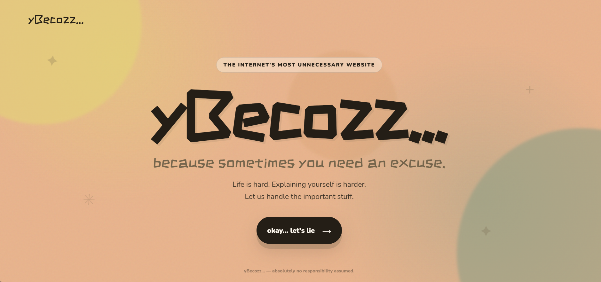
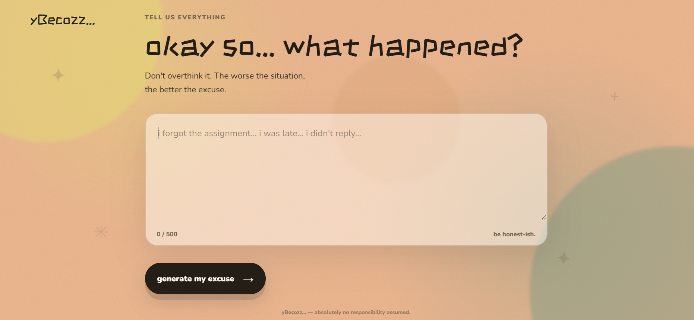
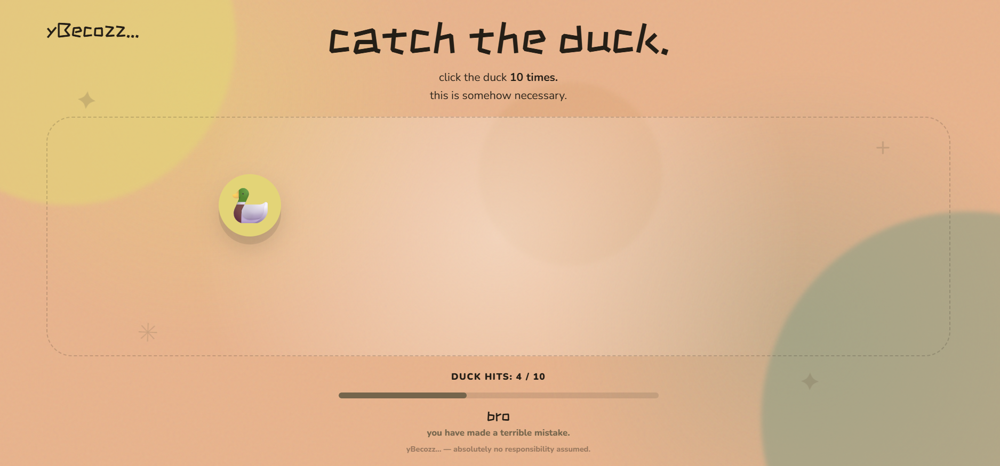
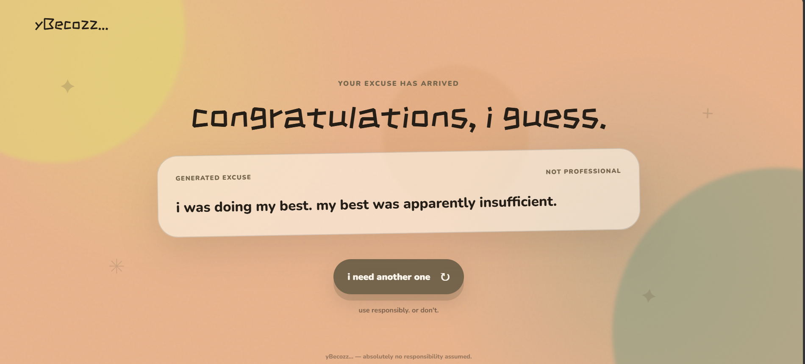

# yBecozz... 🎯

> Because sometimes you need an excuse.

## Basic Details

### Team Name

**[Ladybugs]**

### Team Members

* **Team Lead:** [Adithya D] - [Lbs Institute of Technololgy for Women]
* **Member 2:** [Hridya S] - [Lbs Institute of Technololgy for Women]

---

## Project Description

**yBecozz...** is an intentionally useless web application that generates completely unnecessary, highly questionable excuses for everyday situations.

Tell us what happened, survive an extremely important duck-catching task, and unlock an excuse that absolutely nobody asked for.

## The Problem (that doesn't exist)

Sometimes, people have situations where they need an excuse.

The real problem? **Coming up with one requires effort.**

Why waste valuable brain cells creating an excuse when a completely unnecessary website can do it for you?

## The Solution (that nobody asked for)

**yBecozz...** takes your situation, performs some very serious™ fake AI analysis, makes you complete a completely unrelated duck-catching challenge, and finally generates a chaotic Gen-Z excuse.

Because apparently, **catching a duck is a necessary step in explaining why you were late.**

---

# Technical Details

## Technologies/Components Used

### For Software

* **HTML5** – Website structure and page layouts
* **CSS3** – Styling, animations, responsive design and visual effects
* **JavaScript** – Page navigation, fake analysis, duck game, excuse generation and interactions
* **Google Fonts** – Nunito and ZCOOL KuaiLe
* **Web Audio API** – Generates the duck's extremely important quack sound
* **Git & GitHub** – Version control and project hosting
* **VS Code** – Development environment

### For Hardware

**No hardware components were required.**

This project is completely software-based.

---

# Implementation

## For Software

### Installation

Clone the repository:

```bash
git clone <YOUR-GITHUB-REPOSITORY-URL>
```

Navigate into the project folder:

```bash
cd yBecozz
```

No additional packages or dependencies are required.

### Run

Simply open `index.html` in a web browser.

Alternatively, use the **Live Server** extension in VS Code for a smoother development experience.

---

# Project Documentation

## For Software

## Screenshots

### 1. Home Page



*The landing page of yBecozz..., where users are invited to begin their completely unnecessary excuse-generating journey.*

### 2. Situation Page



*Users describe what happened before the website begins its extremely questionable analysis.*

### 3. Duck Game



*The user must catch the duck 10 times because apparently this is essential to generating an excuse.*

### 4. Reward Loading


*The secret excuse database is accessed through a very serious and definitely legitimate loading process.*

### 5. Generated Excuse



*The final excuse is revealed after successfully completing the completely unnecessary duck challenge.*

---

# Diagrams

### Workflow


*The overall workflow of yBecozz... — from entering a situation to receiving the final excuse.*

### Workflow Overview

```text
                ┌─────────────────────┐
                │       HOME PAGE     │
                │  "okay... let's lie"│
                └──────────┬──────────┘
                           │
                           ▼
                ┌─────────────────────┐
                │  ENTER SITUATION    │
                │  "what happened?"   │
                └──────────┬──────────┘
                           │
                           ▼
                ┌─────────────────────┐
                │   FAKE AI ANALYSIS  │
                │  Removing blame...  │
                └──────────┬──────────┘
                           │
                           ▼
                ┌─────────────────────┐
                │     DUCK GAME 🦆    │
                │     Catch 10x       │
                └──────────┬──────────┘
                           │
                           ▼
                ┌─────────────────────┐
                │  REWARD LOADING     │
                │  Excuse Database    │
                └──────────┬──────────┘
                           │
                           ▼
                ┌─────────────────────┐
                │   GENERATED EXCUSE  │
                │   NOT PROFESSIONAL  │
                └─────────────────────┘
```

---

# Project Demo

## Video

[Add your demo video link here]

*The demo video showcases the complete yBecozz... experience — entering a situation, going through the fake AI analysis, catching the duck, accessing the excuse database and receiving the final excuse.*

## Additional Demos

* GitHub Repository: [Add repository link]
* Live Demo: [Add live demo link if available]

---

# Key Features

* 🎯 Simple and playful user interface
* ✍️ Situation-based excuse generation
* 🤖 Fake AI analysis animation
* 🦆 Interactive duck-catching mini-game
* 🔊 Duck quack sound using the Web Audio API
* ⏳ Dramatic "EXCUSE DATABASE" loading screen
* 💀 Gen-Z style excuse responses
* 📱 Responsive design for different screen sizes
* 🚫 Daily excuse limit joke
* 🎨 Custom visual design with animated background elements
* ⚡ No backend or external database required

---

# Team Contributions

* **[Name 1]:** UI/UX design, HTML structure and overall project concept
* **[Name 2]:** CSS styling, animations, responsive design and visual effects
* **[Name 3]:** JavaScript functionality, excuse generation, duck game and interaction logic

---

# Future Improvements

Although the website is already unnecessarily functional, future versions could include:

* More excuse categories
* More ridiculous mini-games
* Random fake "AI confidence scores"
* More chaotic loading messages
* More animated website elements
* A completely unnecessary excuse history
* Even more unnecessary features that solve absolutely no real problem

---

## Disclaimer

**yBecozz... is a parody project created for entertainment purposes.**

The excuses generated by this website are intentionally ridiculous and should probably not be used as actual explanations.

Please blame the duck instead. 🦆

---

Made with ❤️ at **TinkerHub Useless Projects**


# [Project Name] 🎯


## Basic Details
### Team Name: [Name]


### Team Members
- Team Lead: [Name] - [College]
- Member 2: [Name] - [College]
- Member 3: [Name] - [College]

### Project Description
[2-3 lines about what your project does]

### The Problem (that doesn't exist)
[What ridiculous problem are you solving?]

### The Solution (that nobody asked for)
[How are you solving it? Keep it fun!]

## Technical Details
### Technologies/Components Used
For Software:
- [Languages used]
- [Frameworks used]
- [Libraries used]
- [Tools used]

For Hardware:
- [List main components]
- [List specifications]
- [List tools required]

### Implementation
For Software:
# Installation
[commands]

# Run
[commands]

### Project Documentation
For Software:

# Screenshots (Add at least 3)

*Add caption explaining what this shows*


*Add caption explaining what this shows*


*Add caption explaining what this shows*

# Diagrams

*Add caption explaining your workflow*

For Hardware:

# Schematic & Circuit

*Add caption explaining connections*


*Add caption explaining the schematic*

# Build Photos

*List out all components shown*


*Explain the build steps*


*Explain the final build*

### Project Demo
# Video
[Add your demo video link here]
*Explain what the video demonstrates*

# Additional Demos
[Add any extra demo materials/links]

## Team Contributions
- [Name 1]: [Specific contributions]
- [Name 2]: [Specific contributions]
- [Name 3]: [Specific contributions]

---
Made with ❤️ at TinkerHub Useless Projects 


